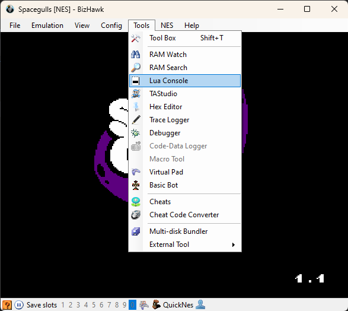
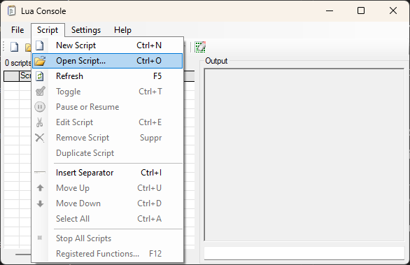
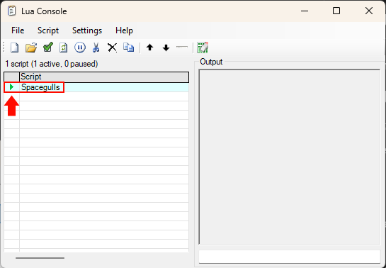

# Auto-Splitter-Scripts

## LUA Scripts

### *Installation*

**Prérequis**: 
- Emulateur Bizhawk
- LiveSplit 1.7+

Ouvrez l'émulateur EmuHawk.exe, puis allez dans l'onglet `Tools` et ouvrez la `Lua Console` afin de pouvoir importer le script `LUA`.



Une fois dans la `LUA Console`, allez dans l'onglet `Script` -> `Open script` et sélectionnez le fichier `.lua` que vous voulez.



N'oubliez pas de laisser la `LUA Console` ouverte pour garder le script actif. (vous pouvez la réduire)!

Si vous ne pouvez pas démarrer le script, assurez-vous que votre LiveSplit soit ouvert.



## Troubleshooting

### J'obtiens une erreur "Failed to open LiveSplit named pipe!"

```
NLua.Exceptions.LuaScriptException: [string "main"]:15: 
Failed to open LiveSplit named pipe!
Please make sure LiveSplit is running and is at least 1.7, then load this script againNLua.Exceptions.LuaScriptException: [string "main"]:15: 
Failed to open LiveSplit named pipe!
Please make sure LiveSplit is running and is at least 1.7, then load this script again
```

Si vous rencontrez cette erreur, celà est probablement dû à un problème de droits d'accès. Livesplit ne doit pas être installé dans un dossier protégé comme par exemple `C:\Program Files\`.

Assurez-vous que BizHawk et LiveSplit soient exécutés depuis un dossier non protégé par des droits d'accès forts. (Par exemple dans `C:\Utilisateurs\Username\Documents\`).
